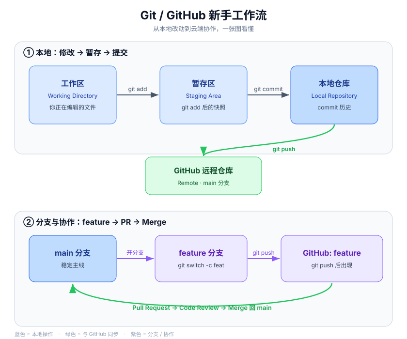

# Git / GitHub 新手指南

> 一份写给完全新手的、可以立刻动手练习的 Git 与 GitHub 图文教程。
> 跟着做，你会在半小时内走完：建仓库 → 提交 → 推送 → 分支 → Pull Request → 解决冲突 → 自动化。

[](https://github.com/sunnyingyang-cpu/hello-github/actions/workflows/ci.yml)


[English](README_EN.md)

## 目录

- [这是什么](#这是什么)
- [先分清 Git 和 GitHub](#先分清-git-和-github)
- [工作流一览](#工作流一览)
- [安装与配置](#安装与配置)
- [最快路径：第一次提交与推送](#最快路径第一次提交与推送)
- [日常工作流](#日常工作流)
- [分支 Branch](#分支-branch)
- [Pull Request](#pull-request)
- [解决合并冲突](#解决合并冲突)
- [GitHub Actions 入门](#github-actions-入门)
- [常见坑与 FAQ](#常见坑与-faq)
- [本仓库自带的练手文件](#本仓库自带的练手文件)
- [一起完善](#一起完善)
- [许可证](#许可证)

## 这是什么

这是一个**用真实提交历史写成的 Git / GitHub 入门教程**。它不只是讲概念，仓库本身就是一个活生生的例子：

- 你能看到的每一个文件，都是通过真实的 `commit` / `branch` / `Pull Request` / 冲突解决产生的；
- 它自带一个会真正运行的 GitHub Actions 工作流（右上角绿勾就是它的状态）；
- 你完全可以把它 `fork` 下来，照着练一遍。

适合谁：还没用过 Git/GitHub，或只用过 `git add . && git commit && git push` 三连、想系统搞懂的人。

## 先分清 Git 和 GitHub

新手最容易混的两个概念：

- **Git**：装在你电脑上的**版本控制工具**，负责记录文件的每次改动（本地就能用）。
- **GitHub**：把 Git 记录**传到网上**托管的平台，用于备份、展示和多人协作。

一句话：Git 管版本，GitHub 管云端和协作。本仓库就在 GitHub 上，而它的版本历史由 Git 记录。

## 工作流一览

先记住这张图，下面的命令都是在填这张图的细节：



- **蓝色（本地）**：你在电脑上用 `git add` / `git commit` 把改动一步步存进本地仓库；
- **绿色（同步）**：用 `git push` 把本地仓库推到 GitHub，之后再 `pull` 拉回最新；
- **紫色（协作）**：开 `feature` 分支干活，推上去后发 Pull Request，审查通过再 Merge 回 `main`。

## 安装与配置

1. 安装 Git：到 https://git-scm.com 下载，按默认选项安装。
2. 配置身份（提交时会署名，只做一次）：

```bash
git config --global user.name "你的名字"
git config --global user.email "you@example.com"
```

3. 认证方式（二选一，推荐 SSH）：
   - **SSH（推荐）**：`ssh-keygen -t ed25519 -C "you@example.com"`，把公钥加到 GitHub → Settings → SSH and GPG keys。
   - **HTTPS + 令牌**：推送时用 Personal Access Token 代替密码（不要用自己的登录密码）。

## 最快路径：第一次提交与推送

```bash
# 1. 在本地项目目录初始化仓库
git init
# 2. 把改动加入暂存区
git add README.md
# 3. 提交一个版本快照
git commit -m "first commit"
# 4. 主线改名为 GitHub 通用的 main
git branch -M main
# 5. 关联远程仓库（换成你自己的地址）
git remote add origin https://github.com/用户名/仓库名.git
# 6. 推送到 GitHub
git push -u origin main
```

完成后打开你的 GitHub 仓库页面，就能看到 `README.md` 已经在云端了。

## 日常工作流

最常用的四条命令，记住这个循环就够了：

```bash
git status            # 查看当前有哪些改动
git add .             # 把改动加入暂存区
git commit -m "说明"  # 提交，说明要写清楚"改了什么、为什么"
git push              # 推送到 GitHub
```

几个有用的补充：

```bash
git diff              # 查看还没暂存的改动细节
git log --oneline     # 看提交历史（一行一条）
git pull              # 拉取远程的最新改动，推送前先 pull 是好习惯
```

写好 commit message 的小技巧：用祈使句开头，比如 `fix: 修复登录失败`、`feat: 新增导出按钮`。

## 分支 Branch

分支 = 在不弄乱主线的前提下，单独开一条工作线。每个新功能 / 修复都建议开分支。

```bash
git switch -c feature-x   # 新建并切换到分支 feature-x
# ... 在分支上改东西、提交 ...
git switch main           # 回到主线
git merge --no-ff feature-x   # 把分支合并进来（保留合并记录）
git branch -d feature-x   # 合并完成后删除分支
```

`--no-ff` 会留下一个明确的"合并提交"，让别人一眼看出这里做过一次功能合并。

## Pull Request

Pull Request（PR）是分支的"协作升级版"：把分支推到 GitHub，正式请求把它并入主线，并留下审查记录。

1. 在分支上改完，`git push -u origin feature-x` 推到 GitHub；
2. 打开仓库页面，点 **Compare & pull request**；
3. 写清楚这次改了什么，点 **Create pull request**；
4. 审查通过后点 **Merge pull request**。

团队里别人就是在这里看你的代码、提意见，再合并的。本仓库的 `git-notes.md` 就是通过一次真实 PR（PR #1）合并进来的。

## 解决合并冲突

当两个分支改了**同一处内容**，Git 无法替你决定保留哪边，就会标出冲突：

```
<<<<<<< HEAD
当前状态：已掌握分支与 PR
=======
当前状态：持续练习，持续学习中
>>>>>>> feature-version-b
```

解决步骤：

1. 打开冲突文件，上面是「当前分支（HEAD）」的内容，下面是「要合并进来的分支」的内容；
2. 删掉 `<<<<<<<` / `=======` / `>>>>>>>` 这些标记，留下你想要的版本（也可以两边各取一部分）；
3. 保存后 `git add 文件名`；
4. `git commit` 完成这次合并提交。

冲突不是错误，是 Git 在请你做决定。本仓库的 `conflict-demo.md` 就是一次真实冲突解决后的产物。

## GitHub Actions 入门

GitHub Actions 让仓库能"自动干活"：每次 push / PR 时自动运行测试、检查或部署。

本仓库就有一个真实的工作流，文件在 `.github/workflows/ci.yml`：

```yaml
name: CI
on:
  push:
    branches: [ main ]
  pull_request:
    branches: [ main ]
jobs:
  check:
    runs-on: ubuntu-latest
    steps:
      - uses: actions/checkout@v4
      - uses: actions/setup-python@v5
        with:
          python-version: '3.12'
      - run: python scripts/ci_check.py
```

要点：`on` 定义触发条件，`jobs` 定义要跑的任务，`steps` 是具体步骤。改完 push，去仓库的 **Actions** 标签页就能看到运行结果。

> 注意：用 Personal Access Token 推送 workflow 文件时，令牌需要 `workflow` 作用域，否则会被拒绝。

## 常见坑与 FAQ

- **提交作者不是我 / 没有头像？** Git 邮箱要和 GitHub 里「已验证」的邮箱一致。
- **push 时提示要输入密码却总错？** GitHub 已不支持密码登录，改用 PAT 或 SSH。
- **改了错误的提交？** 还没推送可用 `git commit --amend`；已推送建议用 `git revert`（更安全，不改写历史）。
- **怎么删除仓库？** 仓库 Settings → 最底部 Danger Zone → Delete this repository。
- **`refusing to allow ... without 'workflow' scope`？** 推送 Actions 工作流需要令牌带 `workflow` 权限。

## 本仓库自带的练手文件

这些文件都是用真实 Git 操作产生的，你可以打开看、也可以 `fork` 后照着练：

- `about.md` —— 通过分支练习新增的自我介绍
- `git-notes.md` —— 通过 Pull Request 合并进来的学习笔记
- `conflict-demo.md` —— 一次真实合并冲突解决后的结果
- `scripts/ci_check.py` + `.github/workflows/ci.yml` —— 真实运行的自动化示例

## 一起完善

这份指南欢迎补充和纠错：

1. `fork` 本仓库；
2. 开一个分支修改内容；
3. 发起 Pull Request，写明你改了什么。

如果你的修改能让新手更好懂，就会被合并进来，也会出现在提交历史里。

## 许可证

本项目采用 MIT 许可证，可自由使用、修改和分发。
